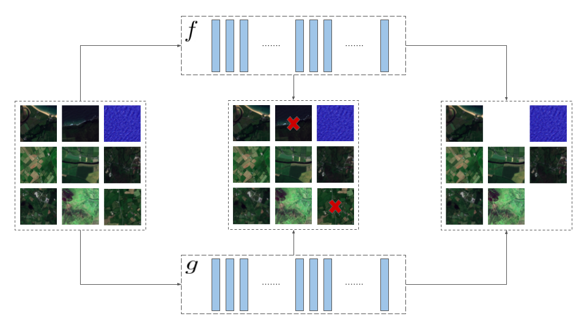

# CCML: A Novel Collaborative Learning Model for Classification of Remote Sensing Images with Noisy Multi-Labels

This repository contains code of the paper `CCML: A Novel Collaborative Learning Model for Classification of Remote Sensing Images with Noisy Multi-Labels`. This work has been developed developed at the [Remote Sensing Image Analysis group](https://www.rsim.tu-berlin.de/menue/remote_sensing_image_analysis_group/) by Ahmet Kerem Aksoy, Mahdyar Ravanbakhsh, Tristan Kreuziger and Begüm Demir.

If you use this code, please cite our paper given below:
> Ahmet Kerem Aksoy, Mahdyar Ravanbakhsh, Tristan Kreuziger, Begüm Demir, "[CCML: A Novel Collaborative Learning Model for Classification of Remote Sensing Images with Noisy Multi-Labels](https://arxiv.org/abs/2012.10715)", arXiv preprint arXiv: 2012.10715, 2020.



_CCML intuition: For a batch of input images, the models `f` and `g` need to agree on a subset, which contains only the correctly annotated images._

## Description

CCML is a multi-label learning method based on the idea of co-training for scene classification of remote sensing (RS) images with noisy labels. CCML identifies noisy samples and excludes them from back-propagation, aiming to train the classifier solely with clean samples. It also detects noisy labels in samples and aims to fix them by means of a relabeling mechanism.

CCML trains two Deep Neural Networks with the same architecture simultaneously. The model is enhanced with a discrepancy module to make the two networks learn complementary features of the same data, while ensuring consistent predictions. This is achieved by creating a statistical difference between the logits of the two networks through the maximum mean discrepancy distance, and then converging the outputs of the networks using the same distance. Learning complementary features allows the two networks to correct each other by selecting clean instances with the loss information provided by the opposite network, and only using the clean instances to update their weights. CCML can also identify noisy labels in samples using the group lasso method. Then, the identified noisy labels can be flipped and incorporated into training with their fixed values. CCML can weigh the potential noisy samples down or up according to the noise type that they include.

## Dependencies
The code in this repository has been tested with `Python 3.7.6`. To run it, the following packages must be installed:
- `tensorflow==2.3.0`
- `tensorflow-gpu==2.3.0`
- `tensorflow-addons==0.11.2`
- `noisifier==0.4.4`
- `scipy==1.5.4`
- `matplotlib==3.3.3`
- `PyYAML==5.3.1`
- `h5py==2.10.0`

## Datasets
We have tested the method on two different RS datasets: [BigEarthNet](http://bigearth.net/) and [UC Merced Land Use dataset](http://weegee.vision.ucmerced.edu/datasets/landuse.html). This repository supports different versions of these datasets:
- BigEarthNet with a 12 class-nomenclature
- BigEarthNet with a 19 class-nomenclature
- BigEarthNet with a 43 class-nomenclature
- UC Merced Land Use dataset annotated with multi-labels provided [here](https://bigearth.eu/datasets)

To use BigEarthNet, three [TFRecord](https://www.tensorflow.org/tutorials/load_data/tfrecord) are needed: `train.tfrecord`, `val.tfrecord` and `test.tfrecord`. The path to the directory containing the three files must be provided as `dataset_path` in the command line arguments.

The UC Merced Land Use dataset is loaded through [pickle](https://docs.python.org/3/library/pickle.html) files. To use it, 6 pickle files must be created: `namely x_train.pickle`, `x_validation.pickle`, `x_test.pickle`, `y_train.pickle`, `y_validation.pickle`, `y_test.pickle`. The directory with these 6 files must be provided as `dataset_path` in the command line arguments.

## Synthetic Label Noise
For testing purposes, we introduced synthetic label noise to the datasets using the python package [noisifier](https://git.tu-berlin.de/rsim/noisifier). The `Random Noise per Sample` label noise approach from the package is applied to the dataset labels.  

## Arguments

- `batch_size`: The size of the mini-batches that are sampled in each epoch from the dataset.
- `epoch`: The number of epochs for the training.
- `arch` : Possible architectures are `resnet`, `denseNet`, `SCNN`, `paper_model`, `keras_model`, `modified_SCNN`, `batched_SCNN`. 
- `dataset_path`: The path to the data as desribed above.
- `channel` : Possible values: `RGB`, `ALL`. Use only `RGB` for UC Merced. Use `ALL` to use 10 bands of BigEarthNet. 
- `label` : Possible values are `BEN-12`, `BEN-19`, `BEN-43`, `ucmerced`. 
- `sigma` : Sigma for the rbf kernel in mmd. 
- `swap` : If 1, swap between models, if 0 do not swap. 
- `swap_rate` : The percentage of swap between models. If there is no swap, set to 1.
- `lambda2` : Strength of the dicrepancy component, a value between 0 and 1.
- `lambda3` : Strength of teh consistency component, a value between 0 and 1.
- `flip_bound` : The percentage of unflipped training epochs.
- `flip_per` : Class flipping percentage determing how much of the consented classes is flipped.
- `miss_alpha` : Rate of missing label noise to be included into the error loss. More missing labels are detected, when this value is high.
- `extra_beta` : Rate of extra label assignment noise to be included into the error loss. More extra label assignments are detected, when this value is high.
- `add_noise` : Add noise to the dataset. Enter 0 for no noise; enter 1 for adding noise.
- `noise_type` : Choose the noise type to be added to the dataset. Possible values are 1 for Random Noise
per Sample and 2 for Mix Label Noise.
- `sample_rate` : Percentage of samples in a mini-batch to be noisified, a value between 0 and 1.
- `class_rate` : Percentage of labels in a sample to be noisified, a value between 0 and 1. Mix Label Noise does not use this.
- `metric` : Possible metrics: `mmd`, `shannon`, `wasserstein`, `nothing`.
- `alpha` : Influence of the group lasso ranking loss compared to binary cross entropy for detection of noisy samples.
- `test` : 1 to test the model using only a small portion of the datasets. Default is 0. 

An example configuration can be found in the `run.sh` file under the `scripts` directory.

## How to run
`pip install -r requirements.txt && mkdir output && cd script/ && ./run.sh`

## Authors
Ahmet Kerem Aksoy

Tristan Kreuziger

## License
The code in this repository is licensed under the **MIT License**:

```
MIT License

Copyright (c) 2019 Ahmet Kerem Aksoy

Permission is hereby granted, free of charge, to any person obtaining a copy
of this software and associated documentation files (the "Software"), to deal
in the Software without restriction, including without limitation the rights
to use, copy, modify, merge, publish, distribute, sublicense, and/or sell
copies of the Software, and to permit persons to whom the Software is
furnished to do so, subject to the following conditions:

The above copyright notice and this permission notice shall be included in all
copies or substantial portions of the Software.

THE SOFTWARE IS PROVIDED "AS IS", WITHOUT WARRANTY OF ANY KIND, EXPRESS OR
IMPLIED, INCLUDING BUT NOT LIMITED TO THE WARRANTIES OF MERCHANTABILITY,
FITNESS FOR A PARTICULAR PURPOSE AND NONINFRINGEMENT. IN NO EVENT SHALL THE
AUTHORS OR COPYRIGHT HOLDERS BE LIABLE FOR ANY CLAIM, DAMAGES OR OTHER
LIABILITY, WHETHER IN AN ACTION OF CONTRACT, TORT OR OTHERWISE, ARISING FROM,
OUT OF OR IN CONNECTION WITH THE SOFTWARE OR THE USE OR OTHER DEALINGS IN THE
SOFTWARE.
```
